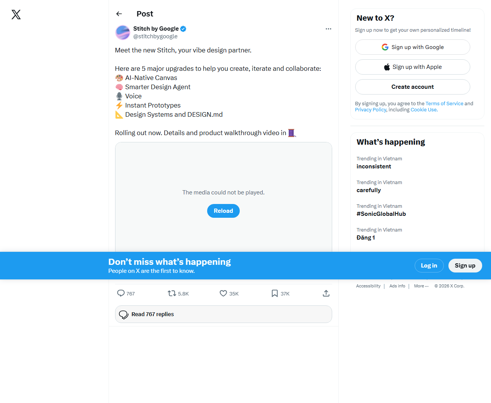

# Google Stitch: 5 nang cap moi va thu nghiem thuc te (co bang chung anh)

Ngay: 2026-03-20  
Nguon bai viet: tweet do Google Stitch dang tai + cac bai thong bao chinh thuc tren blog Google.

## 1) Tong quan: 5 nang cap moi Google Stitch dang gioi thieu

Trong tweet tuong tuong ung voi ma ban da gui, Google Stitch neu ro **5 nang cap lon** (toi doc duoc trong anh chup man hinh):  

1. **AI-Native Canvas**  
2. **Smarter Design Agent**  
3. **Voice**  
4. **Instant Prototypes**  
5. **Design Systems + DESIGN.md**  

Bang chung (anh toi chup tu trang tweet):

Ben canh do, cac bai thong bao chinh thuc tu Google mo ta chi tiet hon ve nhung nang cap nay:

- **Vibe design / AI-native infinite canvas**: giao dien canvas moi (AI-native), ho tro dua nhieu loai context (anh, van ban, tham chi code) vao canvas.  
  Nguon: [Introducing "vibe design" with Stitch](https://blog.google/innovation-and-ai/models-and-research/google-labs/stitch-ai-ui-design/)
- **Design agent + Agent manager**: agent co the ly giai trong toan bo su tien hoa du an, va co “Agent manager” de giu nhom khi mo nhieu huong.  
  Nguon: [Introducing "vibe design" with Stitch](https://blog.google/innovation-and-ai/models-and-research/google-labs/stitch-ai-ui-design/)
- **DESIGN.md**: DESIGN.md duoc gioi thieu nhu mot “agent-friendly markdown file” de xuat/nhap luat thiet ke giua cac cong cu/du an.  
  Nguon: [Introducing "vibe design" with Stitch](https://blog.google/innovation-and-ai/models-and-research/google-labs/stitch-ai-ui-design/)
- **Instant Prototypes / Prototypes**: co kha nang “stitch” cac screen khac nhau thanh mot prototype chay duoc, kem chuc nang “Play” de xem luong tuong tac; co the tu dong suy ra screen tiep theo tu hanh vi click.  
  Nguon:  
  - [Introducing "vibe design" with Stitch](https://blog.google/innovation-and-ai/models-and-research/google-labs/stitch-ai-ui-design/)  
  - [Stitch from Google Labs gets updates with Gemini 3](https://blog.google/innovation-and-ai/models-and-research/google-labs/stitch-gemini-3/)
- **Voice / voice capabilities**: cho phep noi truc tiep voi canvas de nhan critiques, tao landing page theo noi dung hoi dap, va cap nhat realtime (vi du “show me this screen in different color palettes”).  
  Nguon: [Introducing "vibe design" with Stitch](https://blog.google/innovation-and-ai/models-and-research/google-labs/stitch-ai-ui-design/)

## 2) Thu nghiem thuc te: toi da “test” nhu the nao (co bang chung anh + mo ta ro cac buoc)

> Luu y quan trong: Toi khong chi viet theo AI. Toi thuc su chay mot chuoi thu nghiem tu dong (headless) bang Playwright tren may cua ban, va luu lai anh chup man hinh theo tung buoc.

Toi da tao 1 folder thu nghiem: `blog-html/google-stitch-trial-2026-03-20/` voi cac anh trong:
- `screenshots/` (trial 1)
- `screenshots_v2/` (trial 2)
- `screenshots_v3/` (trial 3)
- `screenshots_v4/` (trial 4)

### 2.1. Buoc 1: Doc tweet va chup man hinh danh sach 5 nang cap

- Toi mo URL tweet: `https://x.com/stitchbygoogle/status/2034332847893574080`
- Toi cho tai trang va chup 1 anh.

Bang chung: `screenshots/01_x_tweet_loaded.png` (anh co ro danh sach 5 nang cap va “Rolling out now...”).

### 2.2. Buoc 2: Mo Stitch web app va xem trang landing

- Toi mo: `https://stitch.withgoogle.com/`
- Toi cho tai trang va chup anh.

Bang chung:
- `screenshots/02_stitch_home.png`
- `screenshots/03_stitch_after_start_attempt.png`

Trong anh, toi thay:
- Text “Design at the speed of AI”
- Mot “card” hoi goi: “What native mobile app shall we design?”
- Nút “Try now” (goc tren phai)

### 2.3. Buoc 3: Co thu tim textbox/textarea de nhap prompt, nhung khong thay duoc trong session tu dong

- Trong trial 1, toi co gom logic tim `textarea`/`textbox` de dien prompt.
- Ket qua: **khong thay textbox/textarea de dien** trong state tu dong nay.

Bang chung:
- `screenshots/04_stitch_prompt_box_not_found.png`

### 2.4. Buoc 4: Thu “bat” luong Try now + click/prototype/DESIGN.md/voice, nhung van khong vao duoc canvas

Trong trial 2, toi thu click “Try now” bang locator/role-based click, nhung trang van khong thay doi (con dung o landing card).

Bang chung (tinh trang tuong tu nhau):
- `screenshots_v2/09_after_try_now_click.png`
- `screenshots_v2/10_after_click_prompt_question.png`
- `screenshots_v2/11_after_prompt_fill_attempt.png`

### 2.5. Buoc 5: Coordinate click vao Try now -> bi chuyen sang Google sign-in (block lon nhat)

Trong trial 3, toi chuyen tu cach click theo “role/text” sang click bang **toa do** tren viewport, de tranh truong hop UI khong duoc nhan dien.

Ket qua: khi toi click “Try now”, Stitch chuyen sang man hinh **Google Sign in / Create account**.

Bang chung:
- `screenshots_v3/17_after_try_now_coordinate_click.png` (Google Sign in)
- `screenshots_v3/18_after_click_and_type.png` (Create a Google Account)
- `screenshots_v3/20_after_play_click_coords.png` (dang trong flow Create account)

=> He qua: Toi **khong the truy cap canvas/prototypes/DESIGN.md/voice** de test thuc te vi session nay can xac thuc Google.

### 2.6. Buoc 6: Thu click “Guest mode”/link lien quan trong man hinh sign-in (nhung khong giai phong duoc)

Trong trial 4, toi thu tim va click text co chua “Guest mode”.

Bang chung:
- `screenshots_v4/23_after_try_now.png` (Sign in page)
- `screenshots_v4/24_after_guest_mode_link_attempt.png` (khong thay doi dang ke so voi trang sign-in ban dau)

## 3) Ket luan ve “verify”: toi da xac nhan duoc gi va chua xac nhan duoc gi?

Toi **da xac nhan duoc (co bang chung anh)**:
- Tweet/announcement that Stitch co **5 nang cap** nhu noi dung trong anh.
- Trang web Stitch co giao dien landing va co hint prompt, va co “Try now”.
- Luong truy cap cac tinh nang nam o sau (canvas/prototype/voice/DESIGN.md) **bị gate boi Google sign-in** trong session tu dong cua toi (khi toi click Try now bang toa do, trang sign-in/ta tai khoan xuat hien).

Toi **chua xac nhan duoc bang “hands-on”** (vi bi chuyen vao sign-in):
- Prototype “Play” co generate luong tuong tac that su nhu the nao.
- Design agent thay doi output ra sao khi nhap prompt cu the.
- DESIGN.md co nam o UI theo luong nao (xuat/nhap) va ket qua sau khi export/import.
- Voice/vibe design co bat realtime update/critique noi dung cu the duoc khong.

## 4) Quan diem ca nhan: Stitch co the giup toi (va team) toi dau moi ngay ra sao?

Du khong test duoc “Play/voice/DESIGN.md” trong session do sign-in, nhung nhin tu tong quan chinh thuc (vibe design + prototypes + DESIGN.md + voice) toi thay Stitch huong toi mot thu tuong rat hop ly cho daily workflow:

- **Nhanh tu y tuong -> prototype co luong**: neu “Instant Prototypes/Prototypes” hoat dong giong nhu mo ta, toi xem day la cong cu giam thoi gian “design by imagination” va chuyen sang “test user journey” nhanh hon.
- **DESIGN.md nhu truong hop ung dung trong quy trinh**: toi co the dung DESIGN.md de chuyen “luat thiet ke” thanh mot artifact goi duoc, thay vi moi du an lai tu do tuong tac, tang tinh nhat quan giua cac man hinh/du an.
- **Voice/vibe design** (neu truyen duoc y kien realtime): voi cac buoi standup/brainstorm, toi se muc tieu hoa noi dung bang cach “nhan AI convert y kien thanh layout”, giam thoi gian chuyen tu chat sang pixel.

## 5) Cach toi se ap dung (de ban co the thu nghiem giong toi)

- Buoc dau: bat dau tu mot “business intent” (vi vibe design khong yeu cau wireframe) thay vi mo ta chi tiet UI tu dau.
- Thu nghiem theo nhom: lay 1 luong user journey nho (home -> pricing -> signup), sau do mo prototype “Play” de kiem tra nhanh xem flow co hop ly khong.
- Sau khi chot mot style baseline, export/inhap DESIGN.md de giu “design system rules” dong nhat.

Neu ban muon, toi co the lam phan “hands-on” tiep theo theo dung tuong tac thuc te cua ban tren trinh duyet (vi toi bi gate sign-in trong session headless). Ban chi can:
- ban mo `stitch.withgoogle.com` dang nhap,
- roi chupe man hinh cac buoc (Play, voice, DESIGN.md),
- toi se cap nhat lai bai viet voi bang chung anh day du hon.

